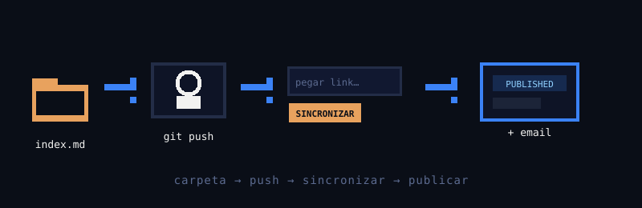

Este es el primer post publicado con el nuevo flujo de Dipper: el contenido ya no vive en
Supabase Storage ni se sube desde un editor en `/admin`. Vive **en este mismo repositorio**,
como un archivo Markdown normal dentro de una carpeta.

## La convención

Cada post es una carpeta en `content/posts/<slug>/` con dos cosas:

- `index.md`: el frontmatter (título, resumen, tags, serie) y el cuerpo del post.
- `images/`: los recursos que use el post, referenciados con rutas relativas.

Por ejemplo, la imagen de abajo vive en `./images/flujo.svg`, junto a este mismo archivo:



## Publicar un post

1. Se crea la carpeta del post con su `index.md` e imágenes, y se hace `git push` a `main`.
2. En `/admin` se pega el link al `index.md` o a la carpeta del post en GitHub.
3. Se hace clic en **SINCRONIZAR**: el backend descarga el Markdown, valida el frontmatter y
   calcula el tiempo de lectura.
4. El post queda en `draft`, anclado al commit (`SHA`) que se sincronizó.
5. **PUBLICAR + EMAIL** lo pasa a público y avisa a los suscriptores.

Para editar un post ya publicado: se hace `push` de los cambios y se pulsa
**RE-SINCRONIZAR**, que toma el nuevo `SHA` sin tocar el estado de publicación.

## Un poco de código

Así se ve, a alto nivel, la función que resuelve un link pegado en el panel:

```ts
function parseContentLink(url: string) {
  // acepta blob, tree, raw o una ruta relativa dentro del repo
  // y siempre devuelve { repo, ref, dir }
  return { repo: 'DidierParody/Dipper', ref: 'main', dir: 'content/posts/hola-desde-el-repo' };
}
```

## Qué cambia para quien lee

| Antes | Ahora |
|---|---|
| Contenido en Supabase Storage | Contenido en el repo de GitHub |
| Editor Markdown en `/admin` | Un link + botón SINCRONIZAR |
| Imágenes subidas a mano | Imágenes relativas junto al `index.md` |
| Importador de Google Drive | Ya no existe |

Nada de esto cambia cómo se ve el blog puertas afuera: sigue siendo el mismo sitio,
solo que ahora el repo es la fuente de verdad.
