## **MER:**

Aquí obtenemos tres cosas:

1. Las entidades.
2. Atributos.
3. Relaciones.
4. Cardinalidades.

Se resume en eso, con ciertas reglas interesantes, como la mejor manera de aprender es practicando, vamos de manos a la obra con el caso de estudio.

> 💡 En un día cualquiera como desarrollador, decides generar un medio de impacto y divulgación sobre tus opiniones y conocimientos, para ello desarrollas un blog personal con las siguientes características:
>
> - Permitir subscriptores y mantenerlos actualizados para nuevo contenido.
> - Cada post en formado md que nuestro frontend pueda renderizar.
> - Usar como object storage de nuestros documentos e imágenes un repositorio de github.
> - Permitir series de posts (se leen en secuencia).
> - categorizar los posts.

---

Ok, con este  caso de estudio definido, vamos con el paso a paso:

### Definir entidades

Las entidades encontradas en el caso de  estudio son:

- `posts` .
- `series` .
- `tags` .
- `post_resources` .
- `newletter_sends` .
- `subscribers` .

> Aclaro que esto queda fuera del alcance del objetivo de este post, sin embargo quisiera contextualizar a la audiencia.

Nótese algo interesante, en mi caso, necesito una tabla `post_resources`  debido a que mi intención es mostrar contenido (los famosos datos no estructurados), por buenas prácticas *¡nunca se debe almacenar en una base de datos estos tipos de datos!,* usualmente lo que hacemos es almacenarlos en algo llamado un [object storage](https://aws.amazon.com/what-is/object-storage/) y guardamos las referencias a los objetos almacenados en él en nuestra base de datos
> 

---

### Definir atributos

Los atributos asociados a cada identidad no resultan de alguna regla(excepto el id, toda entidad debe tener un identificador) como tal, nacen de un análisis del caso de estudio sobre la información que necesitas para llevar a cabo la creación de tu sistema, en mi caso elegí los siguientes:

- `posts` :

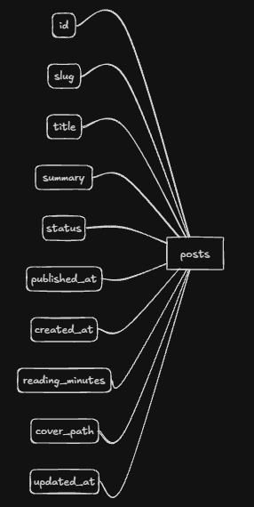

- `series` :

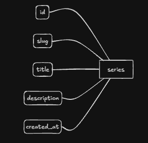

- `tags` :

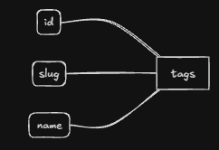

- `post_resources` :

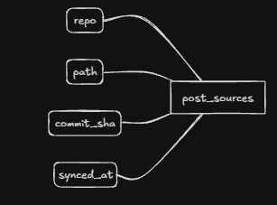

- `newletter_sends` :

- `subscribers` :

> Podemos observar que hasta aquí no existe mención de ninguna foreign key, esto sucede porque actualmente estamos en MER no en MR, aquí no se definen.
> 

---

### Definir relaciones

Un consejo, tener contexto del caso de uso nos permite tener un razonamiento un tanto realista sobre el como se relacionan las entidades, permitiéndonos  definir relaciones *dicientes* y facilitando el trabajo para futuros pasos. No peque por simplemente definir todas las relaciones como ‘Tiene’ y entenderlas como ello. Personalmente intento utilizar diferentes adjetivos o verbos a la hora de definir las relaciones. 

- `series` – `posts` (belongs_to):

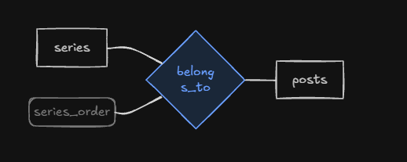

- `posts` – `tags` (post_tags):

- `posts` – `post_sources` (has_source):

- `posts` – `newsletter_sends` (sent_as):

- `newsletter_sends` – `subscribers` (newsletter_deliveries):

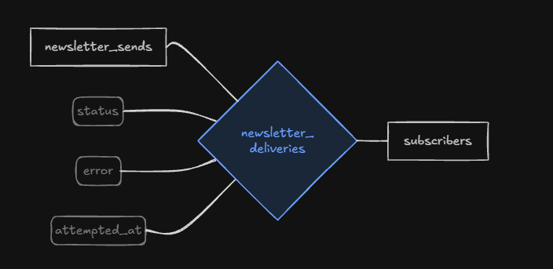

> Hablamos de relaciones, pero ¿por qué en las relaciones `series` – `posts` (belongs_to) y `newsletter_sends` – `subscribers` (newsletter_deliveries) se hace referencia a otros atributos?.
Sí , una relación puede tener atributos, lo vamos a entender en el siguiente paso, y su por qué estará muy bien definido en la transición de MER a MR.
> 

---

### Definir cardinalidades

Este paso debe tener un especial cuidado, debido a que de él depende que nuestro MER evolucione sanamente a MR, y tiene dentro de él unas reglas que vale la pena mencionar.

Para definir una cardinalidad personalmente utilizo cuatro preguntas sencillas que se forman cuando traduces la entidad y las dos relaciones en cuatro frases, que serían su lectura de izquierda a derecha y de derecha a izquierda, vamos a ejemplificar para entender:

La idea es tratar de resolver cada interrogante en el diagrama.

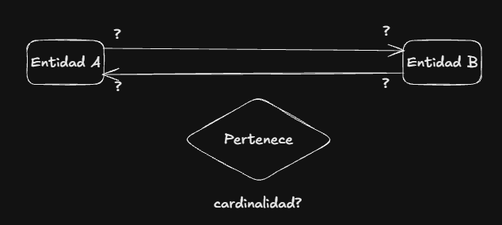

Anteriormente mencioné que recomendaba utilizar relaciones *dicientes*  aquí entenderemos el por qué.

1. Definamos las primeras dos preguntas:
    
    Cuantos de `A` pueden `Pertenecer`  a `B` ?
    
    Cuantos de `B` puede `Pertenecer` a `A` ?
    

> Aclaro que no tenemos que ser literales, la frase no debe ser exactamente esa, simplemente se puede parafrasear para leer las entidades y relaciones y transformarlas en preguntas.
> 

Ahora, para responder, solo tienes dos opciones; N/muchos o 1:

> Aquí no tenemos contexto de un caso practico, entonces asumiremos las respuestas
> 

Cuantos de `A` pueden `Pertenecer`  a `B` ? = 1

Cuantos de `B` puede `Pertenecer` a `A` ? = N

Con ello ya tenemos los principales pesos.

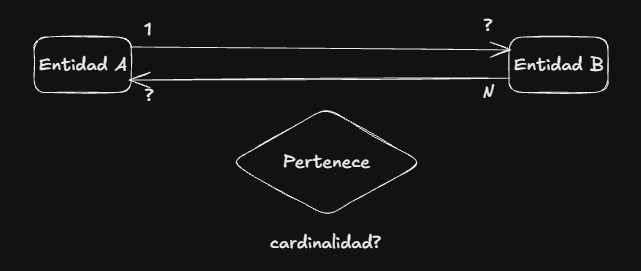

> Podemos ver que aun tenemos interrogantes en el diagrama, en los interrogantes de las flechas, un error es rellenar simplemente con la contraparte de las respuestas, es decir, donde ves un interrogante que apunta a una respuesta cullo valor es 1 poner N y viceversa, !no¡, esto es asumir que no existen relaciones N:N o conocidas como muchos a muchos. Con esa corrección en mente.
> 
1. Definimos las siguientes dos preguntas utilizando la respuesta de las primeras 2:
    
    `1` de `A`  `Pertenece`  a cuantos de  `B` ? 
    
    `N` de `B`  `Pertenece` a cuantos de `A` ? 
    

> Para este ejemplo usaremos las siguientes respuestas:
> 

`1` de `A`  `Pertenece`  a cuantos de  `B` ?  = N

`N` de `B`  `Pertenece` a cuantos de `A` ?  = 1

En el diagrama hemos desaparecido los interrogantes de las entidades.

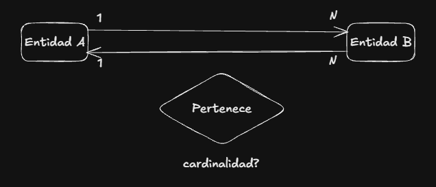

1. Suma de cardinalidades:
    
    Tenemos casi todo despejado, pero, ¿Cuál es la cardinalidad?, mirémoslo como una suma:
    
    `Entidad A` tiene dos valores, uno de la flecha saliente y  el de la flecha entrante podemos verlo de esta manera:
    

$$
\begin{array}{rl}\text{flecha de entrada} & = 1 \\+\;\text{flecha de salida} & = 1 \\\hline\text{cardinalidad} & = 1\end{array}
$$

`Entidad B`  tiene exactamente los mismo parámetros.

$$
\begin{array}{rl}\text{flecha de entrada} & = N \\+\;\text{flecha de salida} & = N \\\hline\text{cardinalidad} & = N\end{array}
$$

> La regla es, la suma es igual a la cardinalidad de mayor valor de cada flecha.
Por ejemplo:
> 

$$
\begin{array}{rl}\text{flecha de entrada} & = N \\+\;\text{flecha de salida} & = 1 \\\hline\text{cardinalidad} & = N\end{array}
$$

Ahora sí prosigamos con nuestro caso práctico:

- `series` – `posts` (belongs_to) · 1:N

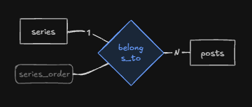

- `posts` – `tags` (post_tags) · N:M

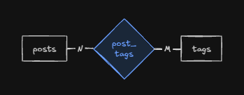

- `posts` – `post_sources` (has_source) · 1:1

- `posts` – `newsletter_sends` (sent_as) · 1:1

- `newsletter_sends` – `subscribers` (newsletter_deliveries) · N:M

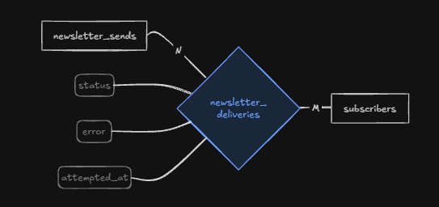

---

### Reglas ocultas

Me parece interesante usar un ejemplo de nuestro caso practico para aclarar unas ultimas reglas antes de pasar a MR.

Si recordamos en la sección de Definir relaciones específicamente la relación `series` – `posts` (belongs_to)  y `newsletter_sends` – `subscribers` (newsletter_deliveries)  encontraremos que tienen algo extraño y es que las relaciones tienen un atributos. Y sí, eso son, tributos, ahora, ¿de donde nacen y por qué se ponen en la relación y no directamente en las entidades?, eso lo explicaremos a continuación.

vamos por casos:

1. Tablas intermedias:
`newsletter_sends` – `subscribers` (newsletter_deliveries) · N:M

> El MER tiene como finalidad ser una herramienta para comprender la causalidad detrás de un MR, esto significa que las entidades a final de cuentas representan lo que el MR llamamos tablas.
> 

Lo que vemos en la imagen no son solo dos entidades, vemos futuras tablas, cuya relación es N:M o mejor conocida como muchos a muchos, cuando tenemos una relación de ese tipo no podemos trabajar las tablas de la misma manera que lo haríamos con relaciones como 1:1 o N:1, ¿por qué?,  porque rompe un concepto que veremos futuramente, algo llamado *Normalización*, específicamente la *1FN.*

> Hasta ahora no habíamos  hablado de forign keys, pero para comprender es necesario aterrizar un poco este concepto; las tablas tienen por naturaleza un id, esto es a lo que llamamos primar key, ese id es el que nos permite relacionar tablas, una foreign key no es más que una columna dentro de otra tabla donde se almacena el id de la primera tabla.
> 

Imagina que ya no estamos en MER, ahora estamos en MR, tienes dos tablas tal que así:

- EMR:

- MR:

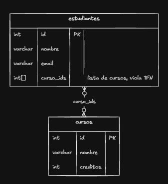

`estudiantes`

| id | nombre | email | curso_ids |
| --- | --- | --- | --- |
| 1 | Ana | ana@mail.com | {1, 2, 3} |
| 2 | Luis | luis@mail.com | {2} |
| 3 | Marta | marta@mail.com | {1, 3} |

`cursos`

| id | nombre | creditos |
| --- | --- | --- |
| 1 | Bases de datos | 4 |
| 2 | Programación | 3 |
| 3 | Estadística | 3 |

Si nos fijamos curso_ids, contiene algo como un array de enteros, esto no sucede por casualidad, resulta que cada estudiante puede tener muchos cursos, pero un curso también tiene muchos estudiante, ¿Cómo los relacionamos en la base de datos?, por medio de sus primary keys, y con foreign keys, en este caso, la tabla estudiante alberga una foreign key que hace referencia a los cursos con los que se asocia el estudiante(cursos_ids) que a su vez es el id o primary key de cada curso. Esto es un error fatal, porque viola el principio de la primera FN de la normalización, que en resumidas cuentas habla de la atomicidad en cada registro, es decir, no debería existir ese array de enteros en ningún registro de las columnas de una tabla.

La solución en este caso es una tabla, por eso la relación en el MER tiene atributos, porque esa es la que vamos a representar como una tabla intermedia en el MR, lo característico de estas tablas no es que tengan atributos, en realidad en el MER tienen atributos debido a que se interpretan como una tabla más, por eso existen muchas veces, pero en realidad su composición básica consiste en almacenar las foreign keys que la relacionan con  sus tablas hermanas, este efecto no se puede ver e el MER, solo en el MR debido a que en el MER no existen las foreign keys,  es decir, vamos a ver algo así:

- MER:

- MR:

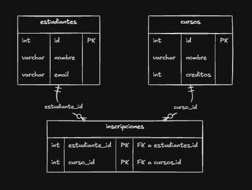

`estudiantes`

| id | nombre | email |
| --- | --- | --- |
| 1 | Ana | ana@mail.com |
| 2 | Luis | luis@mail.com |
| 3 | Marta | marta@mail.com |

`inscripciones`

| estudiante_id | curso_id |
| --- | --- |
| 1 | 1 |
| 1 | 2 |
| 1 | 3 |
| 2 | 2 |
| 3 | 1 |
| 3 | 3 |

`cursos`

| id | nombre | creditos |
| --- | --- | --- |
| 1 | Bases de datos | 4 |
| 2 | Programación | 3 |
| 3 | Estadística | 3 |

1. Juego de análisis:
`series` – `posts` (belongs_to) · 1:N

    
    
    
    Esta tabla es un caso especial, si nos fijamos tiene una relación 1:N, es algo normal, sin embargo estamos asignándole atributos como si fuera una tabla intermedia, y en realidad no lo es, este atributo es resultado del hecho de que un post no siempre pertenece a una serie, en otras palabras si el atributo no está en ninguna serie el atributo no tiene sentido, por eso conceptualmente le pertenece a la relación aunque la decisión más sensata sería incluirlo en la entidad de post y hago énfasis en ello porque se ve así en el MER pero en el MR es distinto, en realidad `series_oder`  pertenece a la tabla de posts.
    
    A final de cuentas, aunque existen reglas la realidad es que todo se vuelve análisis y parte de ese análisis es jugar con las existentes en base a tu contexto.
    
    ---
